# GitOps Architecture: Vercel + Supabase + GitHub

## Architecture Overview

```mermaid
graph TB
    Dev[👨‍💻 Developer] --> |git push| GitHub[📁 GitHub Repository]
    
    subgraph "GitHub Repository"
        Main[🌳 main branch]
        Develop[🌿 develop branch] 
        Feature[🌱 feature/* branches]
        Hotfix[🔧 hotfix/* branches]
    end
    
    subgraph "Supabase Environments"
        ProdDB[(🏭 Production DB)]
        StagingDB[(🧪 Staging DB)]
        LocalDB[(💻 Local DB)]
    end
    
    subgraph "Vercel Deployments"
        ProdDeploy[🌐 Production Deploy<br/>app.example.com]
        StagingDeploy[🔬 Staging Deploy<br/>staging.example.com]
        PreviewDeploy[👁️ Preview Deploys<br/>pr-123.vercel.app]
    end
    
    subgraph "CI/CD Pipeline"
        Tests[🧪 Automated Tests]
        TypeGen[📝 Type Generation]
        Migrations[🔄 DB Migrations]
        Deploy[🚀 Deployment]
    end
    
    Main --> |auto deploy| ProdDeploy
    Main --> |migrations| ProdDB
    Develop --> |auto deploy| StagingDeploy
    Develop --> |migrations| StagingDB
    Feature --> |auto deploy| PreviewDeploy
    Feature --> |no DB changes| LocalDB
    
    GitHub --> Tests
    Tests --> TypeGen
    TypeGen --> Migrations
    Migrations --> Deploy
```



---

## Free Tier Limitations & Architecture Constraints

### Resource Allocation
- **Supabase Free**: 2 projects, 500MB database, 1GB bandwidth/month
- **Vercel Free**: 100GB bandwidth, 6,000 build minutes, unlimited deployments
- **GitHub Free**: Unlimited public repos, 2,000 CI/CD minutes

### Environment Strategy
```
🏭 Production    → Supabase Project #1 + Vercel Production
🧪 Staging       → Supabase Project #2 + Vercel Custom Domain
👁️ Preview       → No dedicated DB + Vercel Preview URLs
💻 Local Dev     → Supabase CLI local stack
```

---

## Project Bootstrap Guide

### Phase 1: Initial Setup

#### 1.1 Create GitHub Repository
```bash
# Create new repository
gh repo create my-app --public --clone
cd my-app

# Initialize with basic structure
mkdir -p .github/workflows
mkdir -p supabase/{migrations,seed}
mkdir -p app/{components,pages,utils}
```

#### 1.2 Initialize Supabase Projects
```bash
# Install Supabase CLI
npm install -g supabase

# Initialize local Supabase
supabase init

# Create production project via dashboard
# → https://supabase.com/dashboard
# → Note project ref: abc123-prod

# Create staging project via dashboard  
# → Note project ref: xyz789-staging
```

#### 1.3 Setup Vercel Integration
```bash
# Install Vercel CLI
npm install -g vercel

# Login and link project
vercel login
vercel link

# Import from GitHub in Vercel Dashboard
# → Connect to GitHub repository
# → Auto-deploy main branch to production
```

#### 1.4 Configure Environment Variables

**GitHub Secrets:**
```yaml
# Repository Settings → Secrets and Variables → Actions
SUPABASE_ACCESS_TOKEN: "your_personal_access_token"
PRODUCTION_PROJECT_ID: "abc123-prod"  
PRODUCTION_DB_PASSWORD: "prod_password"
STAGING_PROJECT_ID: "xyz789-staging"
STAGING_DB_PASSWORD: "staging_password"
```

**Vercel Environment Variables:**
```bash
# Production Environment
NEXT_PUBLIC_SUPABASE_URL=https://abc123-prod.supabase.co
NEXT_PUBLIC_SUPABASE_ANON_KEY=prod_anon_key
SUPABASE_SERVICE_ROLE_KEY=prod_service_key

# Preview Environment (Staging)
NEXT_PUBLIC_SUPABASE_URL=https://xyz789-staging.supabase.co
NEXT_PUBLIC_SUPABASE_ANON_KEY=staging_anon_key
SUPABASE_SERVICE_ROLE_KEY=staging_service_key
```

### Phase 2: Initial Codebase

#### 2.1 Project Structure
```
my-app/
├── .github/workflows/           # CI/CD pipelines
│   ├── ci.yml                  # Tests & validation
│   ├── staging.yml             # Deploy to staging
│   └── production.yml          # Deploy to production
├── supabase/                   # Database schema & config
│   ├── config.toml            # Supabase configuration
│   ├── migrations/            # Schema migrations
│   └── seed.sql              # Sample data
├── app/                       # Next.js application
│   ├── api/                  # API routes
│   ├── components/           # React components
│   └── utils/               # Utilities & helpers
├── tests/                    # Test suites
├── docs/                     # Documentation
└── scripts/                  # Deployment scripts
```

#### 2.2 Base Configuration Files

**supabase/config.toml:**
```toml
[auth]
enabled = true
site_url = "http://localhost:3000"

[auth.external.github]
enabled = true
client_id = "env(SUPABASE_AUTH_GITHUB_CLIENT_ID)"
secret = "env(SUPABASE_AUTH_GITHUB_SECRET)"

[db]
shadow_port = 54320
```

**vercel.json:**
```json
{
  "framework": "nextjs",
  "installCommand": "npm install",
  "buildCommand": "npm run build",
  "devCommand": "npm run dev",
  "functions": {
    "app/api/**/*.js": {
      "maxDuration": 10
    }
  },
  "env": {
    "NEXT_PUBLIC_VERCEL_ENV": "@vercel-env"
  }
}
```

---

## GitOps Workflow Design

### Branching Strategy: Modified Trunk-Based Development


### Branch Types & Purposes

| Branch Type | Purpose | Deployment | Database |
|-------------|---------|------------|----------|
| `main` | Production releases | ✅ Auto → Production | ✅ Migrations applied |
| `develop` | Integration & staging | ✅ Auto → Staging | ✅ Migrations applied |
| `feature/*` | Feature development | ✅ Auto → Preview URLs | ❌ Uses staging DB |
| `hotfix/*` | Critical production fixes | ✅ Auto → Preview URLs | ❌ Uses staging DB |
| `release/*` | Release preparation | ✅ Auto → Preview URLs | ❌ Uses staging DB |

---

## CI/CD Pipeline Architecture

### Workflow 1: Continuous Integration (.github/workflows/ci.yml)

```yaml
name: Continuous Integration

on:
  pull_request:
    branches: [main, develop]
  workflow_dispatch:

jobs:
  lint-and-test:
    runs-on: ubuntu-latest
    steps:
      - uses: actions/checkout@v4
      
      - name: Setup Node.js
        uses: actions/setup-node@v4
        with:
          node-version: '18'
          cache: 'npm'
      
      - name: Install dependencies
        run: npm ci
      
      - name: Run linting
        run: npm run lint
      
      - name: Run type checking
        run: npm run type-check
      
      - name: Run unit tests
        run: npm run test:unit
      
      - name: Run integration tests
        run: npm run test:integration

  database-validation:
    runs-on: ubuntu-latest
    steps:
      - uses: actions/checkout@v4
      
      - uses: supabase/setup-cli@v1
        with:
          version: latest
      
      - name: Start local Supabase
        run: supabase db start
      
      - name: Validate migrations
        run: supabase db reset
      
      - name: Run database tests
        run: supabase test db
      
      - name: Generate types
        run: supabase gen types typescript --local > types/database.ts
      
      - name: Verify types are up to date
        run: |
          if ! git diff --exit-code types/database.ts; then
            echo "Database types are not up to date. Please regenerate them."
            exit 1
          fi

  build-validation:
    runs-on: ubuntu-latest
    steps:
      - uses: actions/checkout@v4
      
      - name: Setup Node.js
        uses: actions/setup-node@v4
        with:
          node-version: '18'
          cache: 'npm'
      
      - name: Install dependencies
        run: npm ci
      
      - name: Build application
        run: npm run build
        env:
          NEXT_PUBLIC_SUPABASE_URL: ${{ secrets.STAGING_SUPABASE_URL }}
          NEXT_PUBLIC_SUPABASE_ANON_KEY: ${{ secrets.STAGING_SUPABASE_ANON_KEY }}
```

### Workflow 2: Staging Deployment (.github/workflows/staging.yml)

```yaml
name: Deploy to Staging

on:
  push:
    branches: [develop]
  workflow_dispatch:

jobs:
  deploy-database:
    runs-on: ubuntu-latest
    environment: staging
    steps:
      - uses: actions/checkout@v4
      
      - uses: supabase/setup-cli@v1
        with:
          version: latest
      
      - name: Deploy migrations to staging
        run: |
          supabase link --project-ref ${{ secrets.STAGING_PROJECT_ID }}
          supabase db push
        env:
          SUPABASE_ACCESS_TOKEN: ${{ secrets.SUPABASE_ACCESS_TOKEN }}
          SUPABASE_DB_PASSWORD: ${{ secrets.STAGING_DB_PASSWORD }}
      
      - name: Update types
        run: |
          supabase gen types typescript > types/database.ts
          
      - name: Commit updated types
        uses: stefanzweifel/git-auto-commit-action@v4
        with:
          commit_message: 'chore: update database types from staging'
          file_pattern: 'types/database.ts'

  deploy-application:
    runs-on: ubuntu-latest
    needs: deploy-database
    steps:
      - name: Deploy to Vercel
        uses: amondnet/vercel-action@v25
        with:
          vercel-token: ${{ secrets.VERCEL_TOKEN }}
          vercel-args: '--prod --confirm'
          vercel-org-id: ${{ secrets.VERCEL_ORG_ID }}
          vercel-project-id: ${{ secrets.VERCEL_PROJECT_ID }}
          scope: ${{ secrets.VERCEL_ORG_ID }}
```

### Workflow 3: Production Deployment (.github/workflows/production.yml)

```yaml
name: Deploy to Production

on:
  push:
    branches: [main]
  workflow_dispatch:

jobs:
  deploy-database:
    runs-on: ubuntu-latest
    environment: production
    steps:
      - uses: actions/checkout@v4
      
      - uses: supabase/setup-cli@v1
        with:
          version: latest
      
      - name: Deploy migrations to production
        run: |
          supabase link --project-ref ${{ secrets.PRODUCTION_PROJECT_ID }}
          supabase db push
        env:
          SUPABASE_ACCESS_TOKEN: ${{ secrets.SUPABASE_ACCESS_TOKEN }}
          SUPABASE_DB_PASSWORD: ${{ secrets.PRODUCTION_DB_PASSWORD }}

  deploy-application:
    runs-on: ubuntu-latest
    needs: deploy-database
    steps:
      - name: Deploy to Vercel
        uses: amondnet/vercel-action@v25
        with:
          vercel-token: ${{ secrets.VERCEL_TOKEN }}
          vercel-args: '--prod'
          vercel-org-id: ${{ secrets.VERCEL_ORG_ID }}
          vercel-project-id: ${{ secrets.VERCEL_PROJECT_ID }}
          scope: ${{ secrets.VERCEL_ORG_ID }}

  post-deployment:
    runs-on: ubuntu-latest
    needs: deploy-application
    steps:
      - name: Run smoke tests
        run: |
          curl -f https://app.example.com/api/health || exit 1
          
      - name: Notify team
        uses: 8398a7/action-slack@v3
        with:
          status: success
          text: '🚀 Production deployment successful!'
        env:
          SLACK_WEBHOOK_URL: ${{ secrets.SLACK_WEBHOOK_URL }}
```

---

## Development Workflows

### Feature Development Workflow


### Database Migration Workflow


### Release Management

#### Weekly Release Cycle
```
Monday-Wednesday:   Feature development on feature/* branches
Thursday:          Code freeze, create release/* branch  
Thursday-Friday:   QA testing on release branch
Friday:           Merge release to main → Production deployment
```

#### Hotfix Process
```
1. Create hotfix/* branch from main
2. Fix critical issue
3. Deploy to preview for validation
4. Merge to main → Auto-deploy to production
5. Merge to develop → Keep branches in sync
```

---

## A/B Testing Strategy

### Implementation Approach (Free Tier Compatible)

Since Vercel's A/B testing requires paid plans, we'll implement a client-side solution:

#### 1. Feature Flag System
```typescript
// utils/featureFlags.ts
export const featureFlags = {
  newCheckoutFlow: {
    enabled: process.env.NODE_ENV === 'production',
    percentage: 50, // 50% of users
    audience: 'all' // 'all', 'premium', 'new_users'
  },
  betaFeatures: {
    enabled: true,
    percentage: 10,
    audience: 'beta_users'
  }
}

export function isFeatureEnabled(flagName: string, userId: string): boolean {
  const flag = featureFlags[flagName]
  if (!flag.enabled) return false
  
  // Use consistent hashing based on userId
  const hash = simpleHash(userId + flagName)
  return (hash % 100) < flag.percentage
}
```

#### 2. A/B Test Implementation
```typescript
// components/ABTest.tsx
interface ABTestProps {
  testName: string
  userId: string
  variantA: React.ReactNode
  variantB: React.ReactNode
  percentage?: number
}

export function ABTest({ testName, userId, variantA, variantB, percentage = 50 }: ABTestProps) {
  const showVariantB = isFeatureEnabled(testName, userId)
  
  // Track experiment exposure
  useEffect(() => {
    analytics.track('experiment_viewed', {
      experiment: testName,
      variant: showVariantB ? 'B' : 'A',
      userId
    })
  }, [testName, userId, showVariantB])
  
  return <>{showVariantB ? variantB : variantA}</>
}
```

#### 3. Analytics Integration
```typescript
// utils/analytics.ts
export const analytics = {
  track: (event: string, properties: Record<string, any>) => {
    // Send to your analytics provider (Google Analytics, PostHog, etc.)
    if (typeof window !== 'undefined') {
      gtag('event', event, properties)
    }
  }
}
```

### A/B Testing Workflow

```mermaid
graph LR
    A[💡 Hypothesis] --> B[🎯 Define Test]
    B --> C[⚡ Implement Variants]
    C --> D[🚀 Deploy to Staging]
    D --> E[✅ QA Validation]
    E --> F[📊 Deploy to Production]
    F --> G[📈 Monitor Metrics]
    G --> H[🎯 Analyze Results]
    H --> I[🏆 Winner Deployed]
```



---

## Environment Management

### Local Development
```bash
# Start local development
supabase start
npm run dev

# Reset database with latest migrations
supabase db reset

# Generate types from local database
supabase gen types typescript --local > types/database.ts
```

### Staging Environment
- **Purpose**: Integration testing, QA validation, stakeholder demos
- **Database**: Dedicated Supabase project with production-like data
- **URL**: `staging.example.com` (custom domain in Vercel)
- **Deployment**: Auto-deploy from `develop` branch

### Production Environment  
- **Purpose**: Live user-facing application
- **Database**: Dedicated Supabase project with live data
- **URL**: `app.example.com` (custom domain)
- **Deployment**: Auto-deploy from `main` branch

### Preview Environments
- **Purpose**: Feature review, stakeholder feedback
- **Database**: Uses staging database (no dedicated DB on free tier)
- **URL**: Auto-generated Vercel preview URLs
- **Deployment**: Auto-deploy from any branch

---

## Monitoring & Observability

### Application Monitoring (Free Tier)

#### 1. Health Check Endpoint
```typescript
// app/api/health/route.ts
export async function GET() {
  try {
    // Check database connectivity
    const { data, error } = await supabase
      .from('_health')
      .select('*')
      .limit(1)
    
    if (error) throw error
    
    return Response.json({ 
      status: 'healthy',
      timestamp: new Date().toISOString(),
      database: 'connected'
    })
  } catch (error) {
    return Response.json({ 
      status: 'unhealthy',
      error: error.message 
    }, { status: 500 })
  }
}
```

#### 2. Error Tracking
```typescript
// utils/errorTracking.ts
export function trackError(error: Error, context?: Record<string, any>) {
  console.error('Application Error:', error, context)
  
  // Send to error tracking service (Sentry free tier)
  if (process.env.NODE_ENV === 'production') {
    // Sentry.captureException(error, { extra: context })
  }
}
```

#### 3. Performance Monitoring
```typescript
// utils/performance.ts
export function measurePerformance(name: string, fn: () => Promise<any>) {
  const start = performance.now()
  
  return fn().finally(() => {
    const duration = performance.now() - start
    console.log(`Performance: ${name} took ${duration}ms`)
    
    // Track performance metrics
    analytics.track('performance_metric', {
      name,
      duration,
      timestamp: Date.now()
    })
  })
}
```

### Database Monitoring

#### 1. Migration Health Check
```sql
-- supabase/migrations/999_health_check.sql
CREATE OR REPLACE FUNCTION check_migration_health()
RETURNS TABLE(
  migration_count INTEGER,
  last_migration_at TIMESTAMP,
  health_status TEXT
) 
LANGUAGE SQL
AS $$
  SELECT 
    COUNT(*)::INTEGER as migration_count,
    MAX(inserted_at) as last_migration_at,
    CASE 
      WHEN COUNT(*) > 0 THEN 'healthy'
      ELSE 'unhealthy'
    END as health_status
  FROM supabase_migrations.schema_migrations;
$$;
```

---

## Continuous Development Practices

### Daily Development Routine

#### Morning Standup Checklist
- [ ] Pull latest changes from `develop`
- [ ] Check CI/CD pipeline status
- [ ] Review overnight deployments
- [ ] Verify staging environment health

#### Feature Development Process
1. **Planning Phase**
   ```bash
   git checkout develop
   git pull origin develop
   git checkout -b feature/user-authentication
   ```

2. **Development Phase**
   ```bash
   # Start local environment
   supabase start
   npm run dev
   
   # Make changes and test locally
   npm run test
   npm run type-check
   ```

3. **Database Changes**
   ```bash
   # Create migration
   supabase migration new "add_user_profiles_table"
   
   # Edit migration file
   # Apply locally
   supabase db reset
   
   # Generate updated types
   supabase gen types typescript --local > types/database.ts
   ```

4. **Testing & Validation**
   ```bash
   npm run test:unit
   npm run test:integration
   npm run build
   ```

5. **Pull Request Process**
   ```bash
   git add .
   git commit -m "feat: add user authentication system"
   git push origin feature/user-authentication
   # Create PR via GitHub UI
   ```

### Weekly Release Process

#### Monday: Planning
- Review product roadmap
- Plan week's features and fixes
- Create feature branches

#### Tuesday-Wednesday: Development
- Active feature development
- Code reviews and merging to `develop`
- Continuous integration testing

#### Thursday: Release Preparation
```bash
# Create release branch
git checkout develop
git pull origin develop
git checkout -b release/v1.2.0

# Update version numbers
npm version minor
git commit -am "chore: bump version to 1.2.0"
git push origin release/v1.2.0
```

#### Friday: Release & Deploy
```bash
# Merge to main
git checkout main
git pull origin main
git merge release/v1.2.0
git push origin main

# Tag release
git tag v1.2.0
git push origin v1.2.0

# Merge back to develop
git checkout develop
git merge main
git push origin develop
```

### Maintenance Tasks

#### Weekly
- [ ] Review and update dependencies
- [ ] Clean up merged branches
- [ ] Review error logs and metrics
- [ ] Backup critical data

#### Monthly
- [ ] Review and optimize database performance
- [ ] Update documentation
- [ ] Review and update CI/CD pipelines
- [ ] Security audit and updates

---

## Scaling Considerations

### When to Upgrade from Free Tiers

#### Supabase Pro ($25/month)
**Triggers:**
- Database size > 500MB
- Need for daily backups
- Require Point-in-Time Recovery
- Need Supabase Branching (when available)

#### Vercel Pro ($20/month)  
**Triggers:**
- Need custom environments for staging
- Require advanced analytics
- Need password protection for previews
- Want native A/B testing

### Performance Optimization

#### Database Optimization
```sql
-- Add indexes for common queries
CREATE INDEX CONCURRENTLY idx_users_email ON users(email);
CREATE INDEX CONCURRENTLY idx_posts_created_at ON posts(created_at DESC);

-- Enable Row Level Security
ALTER TABLE users ENABLE ROW LEVEL SECURITY;
CREATE POLICY "Users can view own data" ON users FOR SELECT USING (auth.uid() = id);
```

#### Application Optimization
```typescript
// Implement caching strategies
export async function getCachedData(key: string) {
  // Use Next.js built-in caching or Redis on upgrade
  return unstable_cache(
    async () => fetchDataFromSupabase(),
    [key],
    { revalidate: 3600 } // 1 hour
  )()
}
```

---

## Security Best Practices

### Environment Security
```bash
# Never commit secrets to git
echo ".env.local" >> .gitignore
echo ".env.*.local" >> .gitignore

# Use GitHub secrets for CI/CD
# Rotate API keys quarterly
# Use least-privilege access
```

### Database Security
```sql
-- Row Level Security policies
CREATE POLICY "Users can only access own data" 
ON user_profiles FOR ALL 
USING (auth.uid() = user_id);

-- Secure functions
CREATE OR REPLACE FUNCTION get_user_profile(user_uuid UUID)
RETURNS TABLE(...) 
SECURITY DEFINER
SET search_path = public
LANGUAGE SQL
AS $$
  SELECT * FROM user_profiles 
  WHERE user_id = user_uuid 
  AND user_id = auth.uid();
$$;
```

### Application Security
```typescript
// Input validation
import { z } from 'zod'

const userSchema = z.object({
  email: z.string().email(),
  name: z.string().min(1).max(100)
})

// CORS configuration
const corsOptions = {
  origin: process.env.NODE_ENV === 'production' 
    ? ['https://app.example.com'] 
    : ['http://localhost:3000'],
  credentials: true
}
```

---

## Troubleshooting Guide

### Common Issues & Solutions

#### Migration Failures
```bash
# Check migration status
supabase migration list

# Reset local database
supabase db reset

# Repair migration history
supabase migration repair
```

#### Type Generation Issues
```bash
# Regenerate types
supabase gen types typescript --local > types/database.ts

# If types are out of sync
git checkout HEAD -- types/database.ts
supabase db reset
supabase gen types typescript --local > types/database.ts
```

#### Deployment Failures
```bash
# Check Vercel deployment logs
vercel logs

# Redeploy manually
vercel --prod

# Check environment variables
vercel env ls
```

### Emergency Procedures

#### Production Hotfix
```bash
# Create hotfix branch from main
git checkout main
git checkout -b hotfix/critical-security-fix

# Make minimal fix
# Test thoroughly
# Deploy to preview for validation

# Merge to main for immediate deployment
git checkout main
git merge hotfix/critical-security-fix
git push origin main

# Merge back to develop
git checkout develop
git merge main
git push origin develop
```

#### Database Rollback
```sql
-- If migration needs rollback, create new migration
-- Never edit existing migration files
-- Example rollback migration:
DROP TABLE IF EXISTS problematic_table;
```

---

This GitOps architecture provides a robust, scalable foundation for continuous development and deployment while maximizing the capabilities of free tier services. The architecture emphasizes automation, safety, and developer productivity while maintaining production reliability.